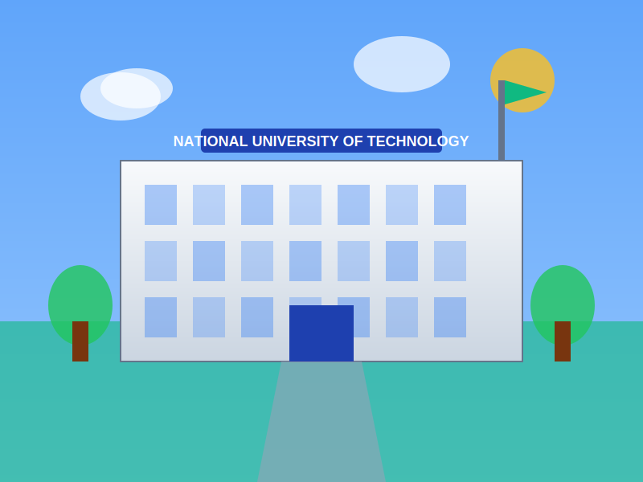
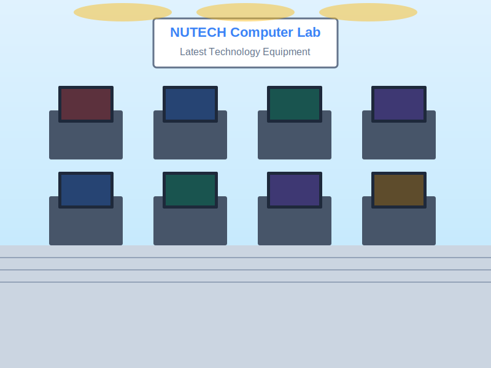
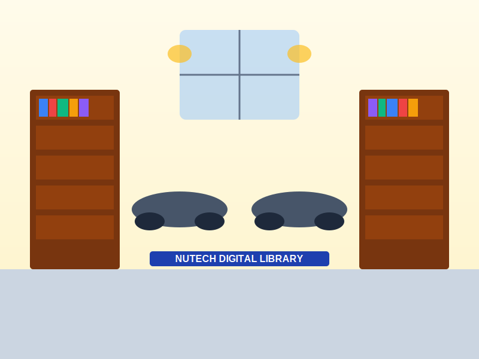

# 📸 HOW TO ADD YOUR REAL NUTECH IMAGES

## 🎯 Quick Guide

Your chatbot currently has **placeholder SVG images**. Follow these simple steps to add real NUTECH photos:

---

## 📷 What Images You Need

### 1. **NUTECH Logo**
   - File name: `nutech-logo.svg` or `nutech-logo.png`
   - Recommended size: 400x400 pixels (or any square size)
   - Format: PNG (with transparent background) or SVG
   - **Where to get it:** NUTECH website or administration

### 2. **Campus Building Photo**
   - File name: `campus-1.svg` or `campus-1.jpg`
   - Size: Any size (will auto-resize)
   - Format: JPG, PNG, or SVG
   - **What to photograph:** Main university building exterior

### 3. **Computer Labs Photo**
   - File name: `campus-2.svg` or `campus-2.jpg`
   - Size: Any size
   - Format: JPG, PNG, or SVG
   - **What to photograph:** Computer lab with students/equipment

### 4. **Library Photo**
   - File name: `campus-3.svg` or `campus-3.jpg`
   - Size: Any size
   - Format: JPG, PNG, or SVG
   - **What to photograph:** Library interior or exterior

---

## ⚡ How to Replace Images

### Method 1: Simple Replacement (Recommended)

1. **Get your photos** (from phone, camera, or NUTECH website)
2. **Rename them exactly:**
   - Your logo → `nutech-logo.png` (or .svg)
   - Building photo → `campus-1.jpg` (or .png or .svg)
   - Labs photo → `campus-2.jpg`
   - Library photo → `campus-3.jpg`
3. **Delete the old placeholder files** (the existing SVG files)
4. **Copy your photos** into the same folder as `index.html`
5. **Refresh the browser** - Done! ✅

### Method 2: Keep Different Names

If you want to keep your own filenames:

1. Open `index.html` in a text editor (Notepad, VS Code, etc.)
2. Find these lines:
   ```html
   
   
   
   
   ```
3. Change to your filenames:
   ```html
   
   
   
   
   ```
4. Save and refresh!

---

## 📸 Where to Get NUTECH Photos

### Option 1: Official Sources
- Visit: https://nutech.edu.pk
- Look for image gallery or about section
- Right-click and save images
- Use Google Images: search "NUTECH Islamabad"

### Option 2: Take Your Own
- Visit NUTECH campus
- Take photos of:
  - Main building entrance
  - Computer labs
  - Library
  - Any impressive facilities
- Make sure photos are clear and professional

### Option 3: Use Social Media
- Check NUTECH's Facebook page
- Instagram: Search #NUTECH
- Download appropriate images
- Get permission if needed

---

## ✅ Image Requirements

### For Best Results:

**Logo:**
- ✓ Square shape (400x400 or similar)
- ✓ Transparent background (PNG)
- ✓ High resolution
- ✓ Official NUTECH logo

**Campus Photos:**
- ✓ Good lighting
- ✓ Clear focus
- ✓ Horizontal orientation (landscape)
- ✓ Professional looking
- ✓ Shows NUTECH positively

**File Size:**
- Keep under 2MB per image
- Compress if needed (use tinypng.com)

---

## 🔧 Troubleshooting

### Logo Not Showing?
1. Check filename is exactly `nutech-logo.svg` or `nutech-logo.png`
2. Make sure it's in the same folder as `index.html`
3. Try different format (PNG instead of SVG or vice versa)
4. Clear browser cache (Ctrl + F5)

### Campus Images Not Showing?
1. Check filenames match exactly (campus-1.jpg, campus-2.jpg, etc.)
2. Verify images are not corrupted (try opening them separately)
3. Make sure they're in correct folder
4. Try different image format
5. Refresh browser with Ctrl + F5

### Images Look Stretched?
- The chatbot automatically adjusts images
- For best results, use landscape (horizontal) photos
- Minimum 800px wide recommended

---

## 💡 Pro Tips

1. **Use official NUTECH brand colors** in photos when possible
2. **Show modern facilities** to attract students
3. **Include people** (students, faculty) for warmth
4. **Ensure good lighting** - avoid dark/blurry photos
5. **Get permission** if using photos from NUTECH website
6. **Compress images** for faster loading
7. **Test on mobile** to see how images look

---

## 📝 Quick Checklist

- [ ] Downloaded/captured real NUTECH photos
- [ ] Renamed files correctly
- [ ] Placed in same folder as index.html
- [ ] Deleted old placeholder SVG files
- [ ] Opened index.html in browser
- [ ] All images showing correctly
- [ ] Tested on mobile device
- [ ] Images look professional

---

## 🆘 Still Having Issues?

### Check These:

1. **File Location:**
   ```
   university-chatbot/
   ├── index.html
   ├── nutech-logo.png     ← Your logo here
   ├── campus-1.jpg        ← Your photos here
   ├── campus-2.jpg
   └── campus-3.jpg
   ```

2. **File Names Are Case-Sensitive:**
   - `campus-1.jpg` ✅
   - `Campus-1.jpg` ❌
   - `CAMPUS-1.JPG` ❌

3. **Supported Formats:**
   - PNG ✅
   - JPG/JPEG ✅
   - SVG ✅
   - GIF ✅
   - WebP ✅

---

## 🎨 Current Placeholder Images

Right now, the chatbot uses **beautiful SVG placeholder images** that show:
- NUTECH logo design
- Modern campus building illustration
- Computer lab visualization
- Library interior design

These work perfectly and look professional, but **real photos will be even better!**

---

## 📞 Need Help?

Contact NUTECH IT Department:
- 📞 +92 51 5476809
- 📧 info@nutech.edu.pk

---

**Remember:** The chatbot works great with the current placeholder images, but adding real NUTECH photos will make it even more authentic and attractive! 🎓✨
